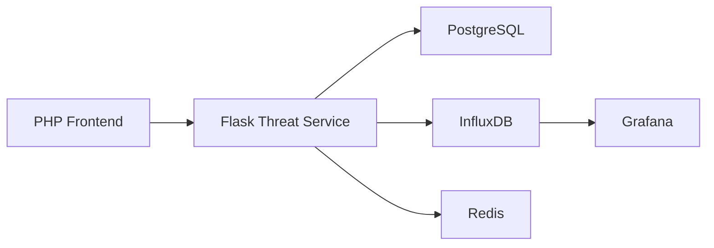
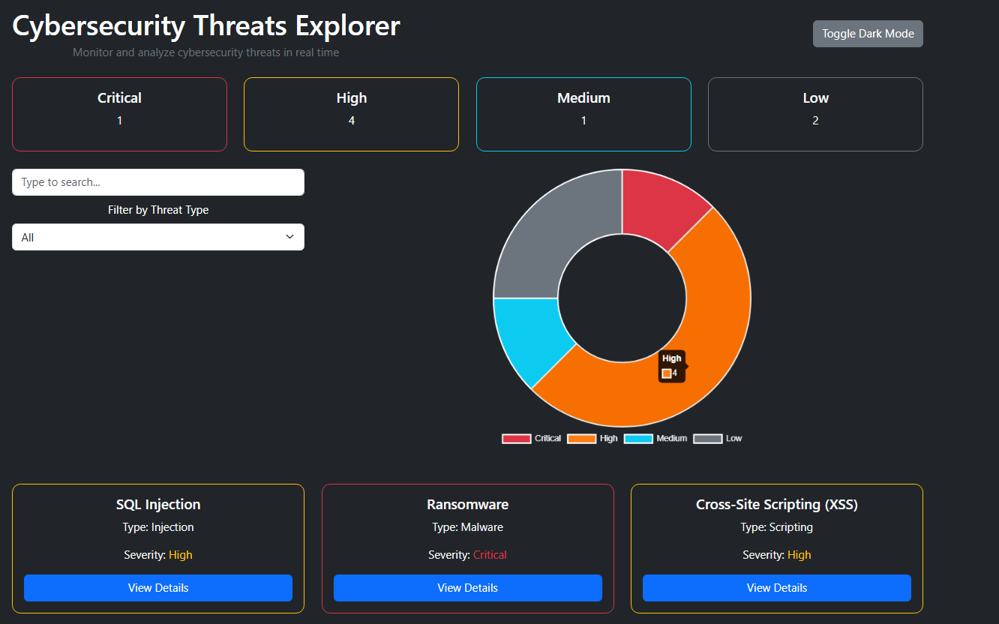
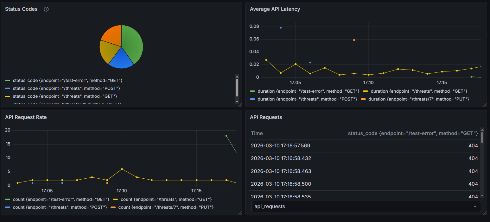

# Cybersecurity Threats Dashboard

A **full-stack cybersecurity threat explorer** for monitoring, filtering and analyzing threats in real time.  
This project combines:

- **PHP frontend** with interactive UI  
- **Flask REST API** serving threat data  
- **PostgreSQL database** for storage  
- **Redis** for caching  
- **InfluxDB** for metrics/logs  
- **Grafana** for dashboards and visualization  
- **Docker Compose** to run everything together

---

##  Features

- Real-time threat monitoring with severity statistics
- Filter threats by type or search by name
- Detailed threat cards with modals for extra information
- Light/Dark mode toggle for frontend
- Metrics logging to InfluxDB and visualization in Grafana
- Containerized with Docker Compose for easy setup

---

##  Architecture Overview



The **PHP frontend** fetches data from the Flask API (`/threats`) and displays it.
- The **Flask API** stores threat data in PostgreSQL and logs metrics in InfluxDB.
- **Grafana** reads metrics from InfluxDB for dashboards.

## Screenshots

### Frontend Homepage


### Grafana Dashboard


---

##  Requirements
- Docker & Docker Compose
- PHP 8+ (for local frontend development)  
- Python 3.12+ (for local Flask service)

---

##  Setup & Run (Docker Compose)

Docker Compose runs all services together including:

- Frontend (PHP/Apache)
- Threat service (Flask)
- PostgreSQL database
- Redis cache
- InfluxDB for metrics
- Grafana for dashboards
- Nginx reverse proxy

###  Steps
1. **Clone the repository**
```bash
git clone https://github.com/CWN221/Cybersecurity-threats-explorer.git
cd Cybersecurity-threats-explorer
```
 
2. Copy .env.example to .env
   ```bash
   cp .env.example .env
   ```
   
3. Edit the .env file
   Update variables like FLASK_HOST, database credentials, ports and pgadmin configuration to match your setup
   
4. Create secrets for InfluxDB in secrets folder (secrets/)
   secrets/influxdb2-admin-username → your_username
   secrets/influxdb2-admin-password → your_password
   secrets/influxdb2-admin-token → your_token
   
5. Start all containers
```bash
  docker-compose up --build -d
```

6. Access the application
   PHP Frontend: http://localhost
   Grafana: http://localhost:3000

   Default Grafana Login
   username: admin
   password: admin
